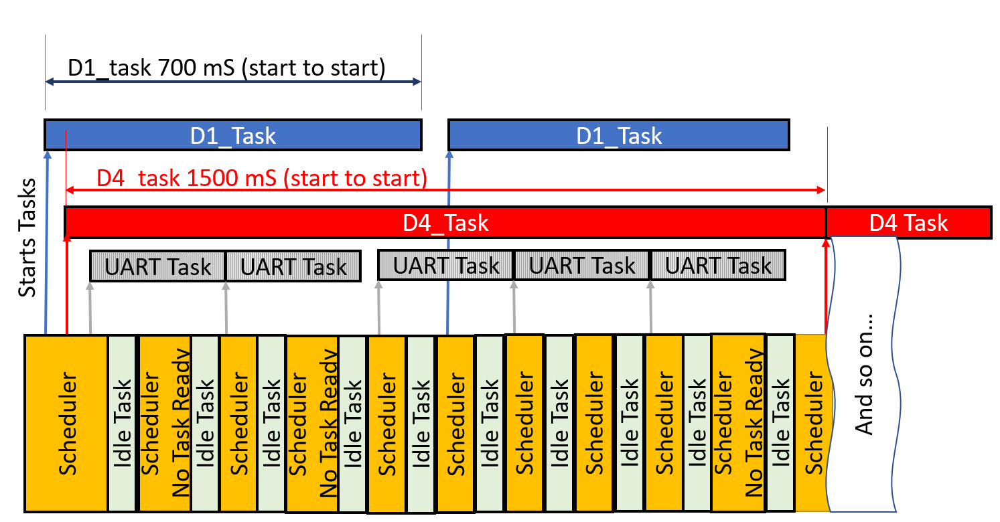
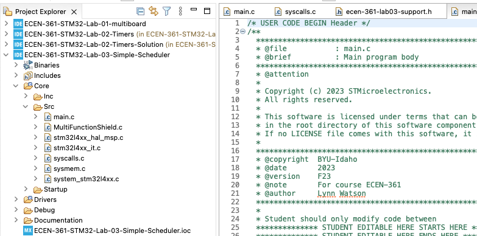
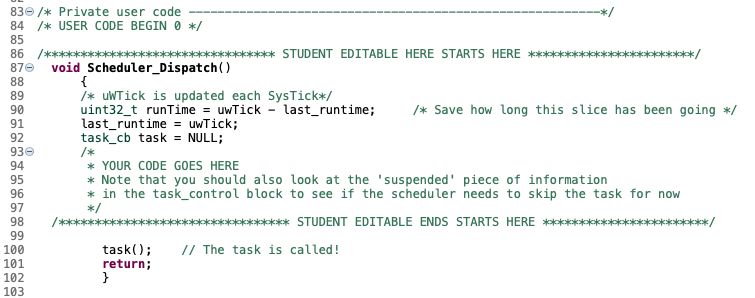
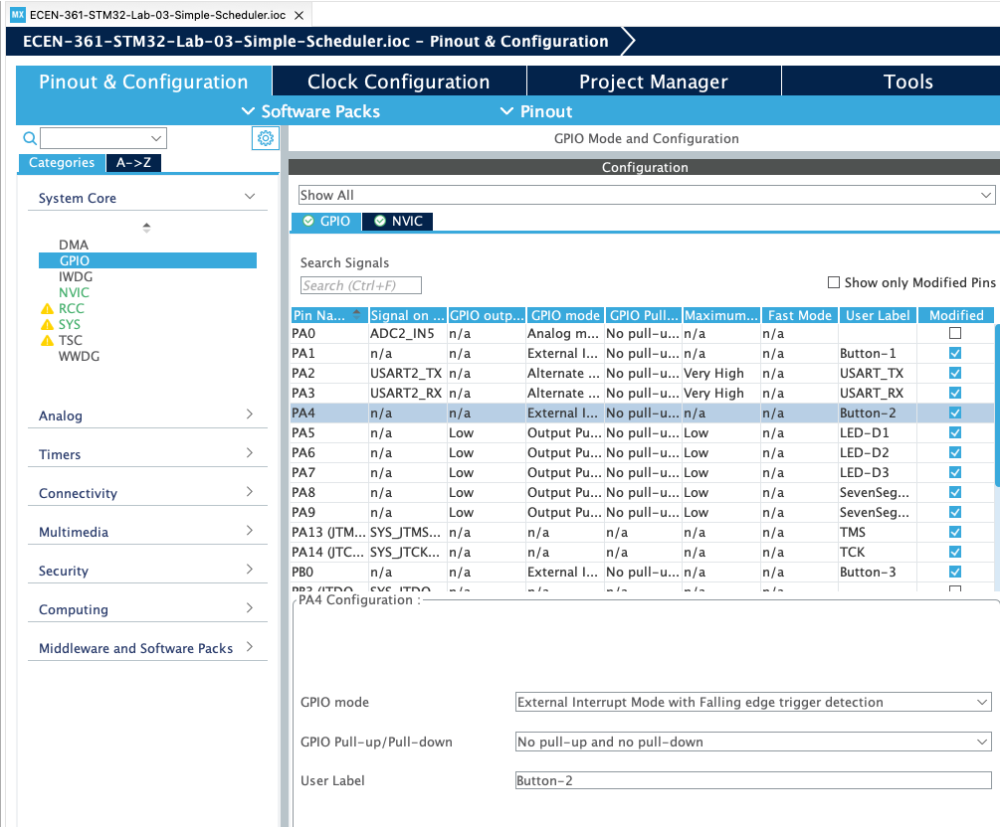

# Lab-03: Writing a Simple Scheduler

## Introduction

In this lab you will create a scheduler on your Nucleo-476RG that will execute three tasks at predetermined rates. To do this you will create a scheduler. A scheduler is a set of code that keeps a queue of possible processes/threads/tasks (we'll say “**task**” here) and decides which of these should be executed at what time on the processor.

In order to keep this simple you will not be implementing a pre-emptive scheduler. A pre-emptive scheduler is a scheduler that can interrupt a task in the middle of execution, save the context (Program Counter/Stack Pointer/Register States), run the scheduler to decide with task should have time on the processor, and then restore that task, then continuing running it.

In this non-pre-emptive scheduler, each task runs and will continue until it is done completed, then the scheduler will determine which task should run next. This scheduler allows the processes to be started at different intervals and seemingly run in parallel. In the scaffolding code provided, there are three tasks written to be run at setup (times can be easily changed:

1. **D1 task**  every 700 mSec

2. **D4 task** every 1500 mSec

3. **Serial Port (UART) Write** every 2000 mSec
   
   **Idle task** runs in-between

When the scheduler runs it will look for any task that should be run (according to its defined start time).

The scheduler will choose the first one in the queue. When that task is run, the scheduler checks to see if it's time for the next one in the queue, and will run that, … , etc. until none are left ready to run. The scheduler will then go into an idle task.

Note that you're not writing a true scheduler with the ability to 'suspend' a given task and then swap to another. This scheduler simply starts the tasks on a pre-defined schedule. Each of the tasks must start and then return to the scheduler. We're not saving task state (“task control block”) information or doing anything like a context switch. For this reason, the tasks have been written to be a simple LED toggle: Toggle the LED and return and wait for the scheduler to come back and toggle again.

### Implementation

Like all schedulers, a 'slice' of time to run a task and look for the next task has to be provided. This is done here, like most, with a Timer Interrupt. The STM32 comes pre-configured with a timer designated to be used as the SYSTICK time slicer. This timer updates an absolute count that keeps track of the number of SysTick (1 milliSecond) clocks since the processor started. The global HAL variable “**uwTick**” increments once every 1mS.

### Setup

Follow the same procedure as previous labs, accepting then cloning the repo from the GitHub classroom (link in the Canvas Assignment). Clean and Build the Project.

There should be no errors or warnings.

As always, source code is in **Core/Src/main.c**

## Lab Activities (6 pts)

Write the remainder of the **Scheduler_Dispatch()** code (about line 80 in **main.c**).

This will be completed by creating a loop to go through the task queue and seeing if it's time to run the task being inspected. Remember to take into consideration the '**suspended'** field in deciding if it should be run or not. Any code written must be between the “EDITABLE” fields, and don't modify lines outside of there. The lines outside are generated by the STM32 .IOC GUI to setup the controller.

  

### You should familiarize yourself with the \`list_of_tasks_to_do' variable, and its associated struct type \`taskControlBlock' in order to utilize them in your task scheduler. They are located in the \`ecen-361-lab03-support.h' header file.

  

You'll be able to verify operation with 3 different output:

- LED_D1 and LED_D4 lights blinking at their appropriate rates.

- The far left and far right 7-Segment displays will count from 0-9 and 0-5 just showing the countups

- The terminal emulator output will show
  
  Output streaming **uwTICK** value each IDLE

If you have difficulty seeing the serial communication coming through a terminal emulator, contact a T/A or Instructor.

1. Verify that the **S1** (GPIO pin is called Button_1) switch suspends **D1_task** blinking process. Note that it stops at the same state (on or off).
2. Add an interrupt for **S2**. This will be a second ISR, that does the same thing for **D4_task**. To add this interrupt, you'll first need to edit the “.IOC” setup file. In the GUI, go to the System Configuration/GPIO/ and tag the pin to be an interrupt:
   

Saving and closing this view will re-generate your **main.c**. You can then modify the **HAL_GPIO_EXTI_Callback()** routine to match the S1 interrupt as appropriate.

## Questions

1. List a shortfall that makes this method not a true 'scheduler'? [*answer here*]

2. Was there any priority built into this system?

3. Are the variables in the processes (D1_task and D4_task) local or global?   How do you tell and why would either be used or must be used?

4. For the interrupts on Button_1/2, why were the GPIO modes set to be Falling edge trigger?

## Ideas for Credit to get to 'A' & Extra-Credit (2 pts for any)

1. Use the 3rd button (S3) to alter the time of a task's execution.  For example, each S3 press increases/decreases the delay by 300mS.

2. Add input from the user via the TTY terminal to adjust the times

3. Suspend one of the processes after it's run a pre-set number of times

4. Put out a message when either/both of the buttons are pressed and the processes suspended.  If both are suspended, quit putting out TTY messages.

5. Your task scheduler list has free space where you could introduce another task; implement another task and describe its functionality.
